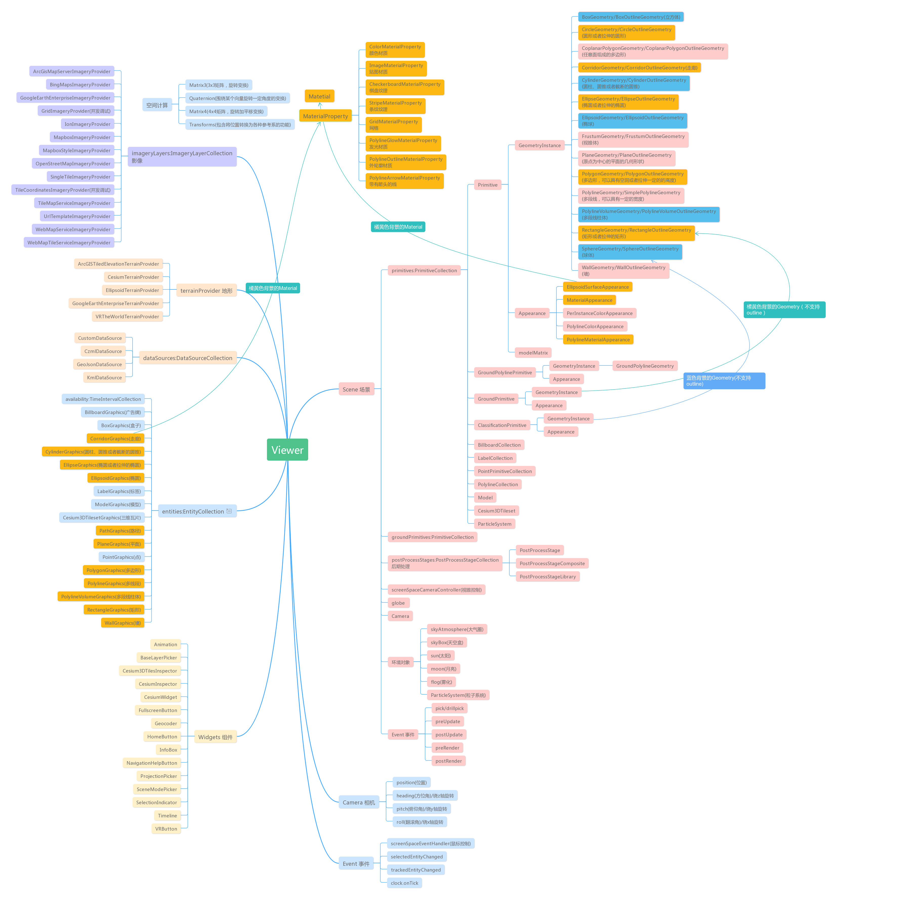

# cesium 实践案例
###### 一些边学习边联系的小案例
|  文件名 |  说明 |
| ------------ | ------------ |
| index.html  |  一个简单的初始化cesium案例 |
| modelTest.html  |  模型加载案例 |

### 建议学习前了解cesium的源码结构

- 到github中下载源码
- 如果npm install 报错，不妨试试最新版的node，建议用nvm管理node版本
- 把package中的script挨个运行一遍，保证启动cesium源码环境后你能看到完整的效果

### 下面是我从网上找到的cesium代码结构图

